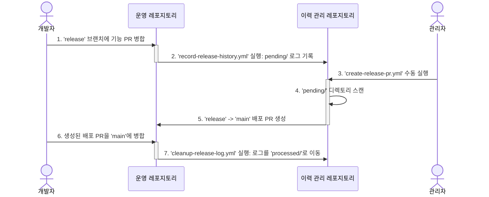

# 릴리즈 프로세스 시퀀스 다이어그램

이 다이어그램은 개발자의 PR 병합부터 배포 PR이 생성되고 아카이빙되기까지의 과정을 시간 순서에 따라 보여줍니다.

```mermaid
sequenceDiagram
    actor Dev as 개발자
    participant OpRepo as 운영 레포지토리
    participant MgmtRepo as 이력 관리 레포지토리
    actor Admin as 관리자

    Dev->>OpRepo: 1. 'release' 브랜치에 기능 PR 병합
    activate OpRepo
    OpRepo->>MgmtRepo: 2. 'record-release-history.yml' 실행: pending/ 로그 기록
    deactivate OpRepo
    
    Admin->>MgmtRepo: 3. 'create-release-pr.yml' 수동 실행
    activate MgmtRepo
    MgmtRepo->>MgmtRepo: 4. 'pending/' 디렉토리 스캔
    MgmtRepo->>OpRepo: 5. 'release' -> 'main' 배포 PR 생성
    deactivate MgmtRepo

    Dev->>OpRepo: 6. 생성된 배포 PR을 'main'에 병합
    activate OpRepo
    OpRepo->>MgmtRepo: 7. 'cleanup-release-log.yml' 실행: 로그를 'processed/'로 이동
    deactivate OpRepo
```
