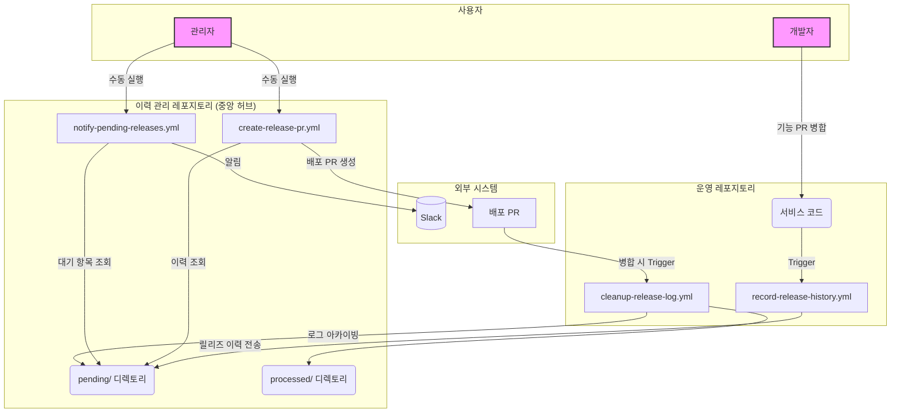

# 전체 시스템 흐름도

이 다이어그램은 중앙 이력 관리 시스템의 전체 구성 요소와 워크플로우 간의 상호작용을 보여줍니다.

```mermaid
graph TD
    subgraph "사용자"
        Dev[개발자]
        Admin[관리자]
    end

    subgraph "운영 레포지토리"
        OpRepo(서비스 코드)
        RecordHistory[record-release-history.yml]
        CleanupLog[cleanup-release-log.yml]
    end
    
    subgraph "이력 관리 레포지토리 (중앙 허브)"
        PendingLogs(pending/ 디렉토리)
        ProcessedLogs(processed/ 디렉토리)
        CreatePR[create-release-pr.yml]
        Notify[notify-pending-releases.yml]
    end

    subgraph "외부 시스템"
        Slack[(Slack)]
        DeploymentPR[배포 PR]
    end

    Dev -- "기능 PR 병합" --> OpRepo
    OpRepo -- "Trigger" --> RecordHistory
    RecordHistory -- "릴리즈 이력 전송" --> PendingLogs

    Admin -- "수동 실행" --> CreatePR
    Admin -- "수동 실행" --> Notify

    CreatePR -- "이력 조회" --> PendingLogs
    CreatePR -- "배포 PR 생성" --> DeploymentPR
    
    Notify -- "대기 항목 조회" --> PendingLogs
    Notify -- "알림" --> Slack

    DeploymentPR -- "병합 시 Trigger" --> CleanupLog
    CleanupLog -- "로그 아카이빙" --> PendingLogs
    CleanupLog -- " " --> ProcessedLogs

    style Dev fill:#f9f,stroke:#333,stroke-width:2px
    style Admin fill:#f9f,stroke:#333,stroke-width:2px
```
